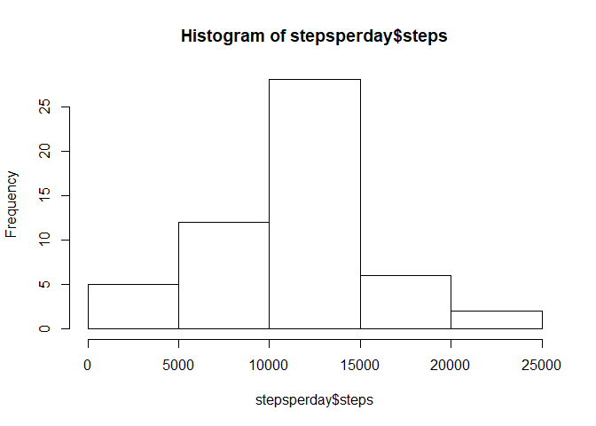
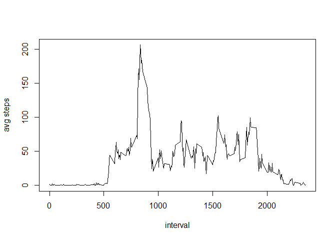
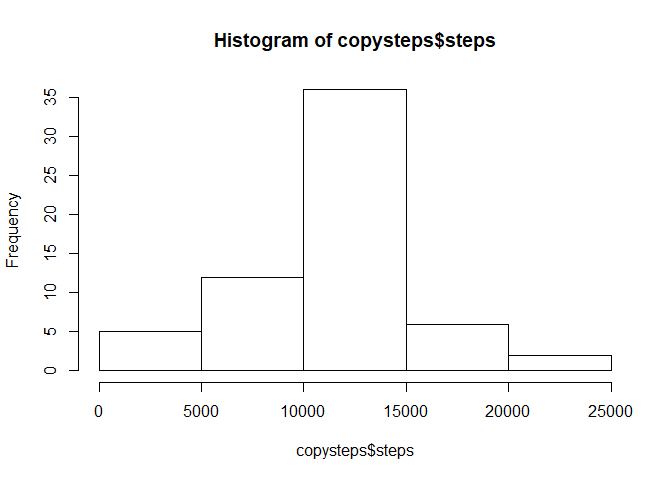
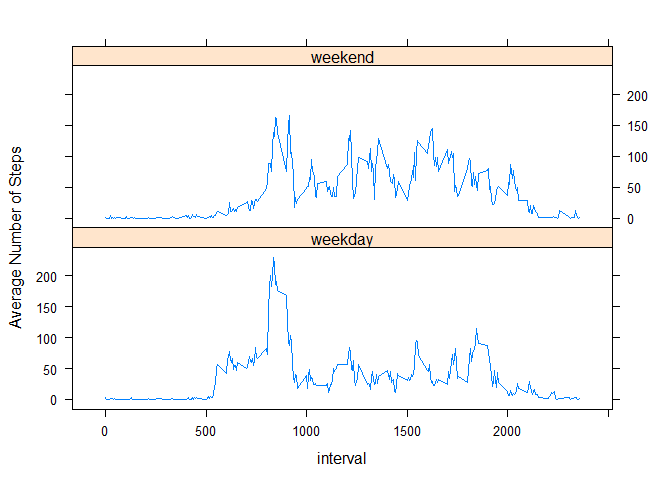

# Course 5 Week 2 Project
Jennifer Byrnes  
September 2, 2017  
### Get Started: Set global variables and load the data.

```r
knitr::opts_chunk$set(echo = TRUE)
setwd("D:/DataScience/R_working/Course5/wk2project")
activity_data<-read.csv("activity_data/activity.csv")
```

## Part 1: What are the mean total steps taken per day?

1. Calculate the total number of steps taken per day
2. Make a histogram of the total number of steps taken each day
3. Calculate and report the mean and median of the total number of steps taken per day

### 1.1. Total Steps Per Day


```r
stepsperday<-aggregate(steps~date,activity_data, FUN=sum, rm.na=TRUE)
stepsperday
```

```
##          date steps
## 1  2012-10-02   127
## 2  2012-10-03 11353
## 3  2012-10-04 12117
## 4  2012-10-05 13295
## 5  2012-10-06 15421
## 6  2012-10-07 11016
## 7  2012-10-09 12812
## 8  2012-10-10  9901
## 9  2012-10-11 10305
## 10 2012-10-12 17383
## 11 2012-10-13 12427
## 12 2012-10-14 15099
## 13 2012-10-15 10140
## 14 2012-10-16 15085
## 15 2012-10-17 13453
## 16 2012-10-18 10057
## 17 2012-10-19 11830
## 18 2012-10-20 10396
## 19 2012-10-21  8822
## 20 2012-10-22 13461
## 21 2012-10-23  8919
## 22 2012-10-24  8356
## 23 2012-10-25  2493
## 24 2012-10-26  6779
## 25 2012-10-27 10120
## 26 2012-10-28 11459
## 27 2012-10-29  5019
## 28 2012-10-30  9820
## 29 2012-10-31 15415
## 30 2012-11-02 10601
## 31 2012-11-03 10572
## 32 2012-11-05 10440
## 33 2012-11-06  8335
## 34 2012-11-07 12884
## 35 2012-11-08  3220
## 36 2012-11-11 12609
## 37 2012-11-12 10766
## 38 2012-11-13  7337
## 39 2012-11-15    42
## 40 2012-11-16  5442
## 41 2012-11-17 14340
## 42 2012-11-18 15111
## 43 2012-11-19  8842
## 44 2012-11-20  4473
## 45 2012-11-21 12788
## 46 2012-11-22 20428
## 47 2012-11-23 21195
## 48 2012-11-24 14479
## 49 2012-11-25 11835
## 50 2012-11-26 11163
## 51 2012-11-27 13647
## 52 2012-11-28 10184
## 53 2012-11-29  7048
```

### 1.2. Histogram of total steps per day


```r
library(graphics)
hist(stepsperday$steps)
```

<!-- -->

### 1.3. Calculate and report the mean and median of total number of steps taken per day


```r
stepmean<-mean(stepsperday$steps)
stepmedian<-median(stepsperday$steps)
```
#### The mean number of steps taken per day is (*r stepmean*)   1.0767189\times 10^{4}.  
#### The median number of steps taken per day is (*r stepmedian*)  10766.

## Part 2: What is the average daily activity pattern?

1. Make a time series plot (i.e. type = "l") of the 5-minute interval (x-axis) and the average number of steps taken, averaged across all days (y-axis)
2. Which 5-minute interval, on average across all the days in the dataset, contains the maximum number of steps?
  
### 2.1 Time Series plot of 5min interval vs avg steps across all days  

```r
avgsteps<-aggregate(steps~interval,activity_data, mean)
plot(avgsteps, type="l", ylab="avg steps")
```

<!-- -->

### 2.2 Which interval, on average across all days, contains the maximum number of steps?


```r
hiint<- avgsteps[avgsteps$steps==max(avgsteps$steps),1]
```
#### The interval with the highest average steps is (*r hiint*) 835.


## Part 3: Imputting missing values
1. Calculate and report the total number of missing values in the dataset (i.e. the total number of rows with NAs)
2. Devise a strategy for filling in all of the missing values in the dataset. The strategy does not need to be sophisticated. For example, you could use the mean/median for that day, or the mean for that 5-minute interval, etc.
3. Create a new dataset that is equal to the original dataset but with the missing data filled in.
4. Make a histogram of the total number of steps taken each day and Calculate and report the mean and median total number of steps taken per day. Do these values differ from the estimates from the first part of the assignment? What is the impact of imputing missing data on the estimates of the total daily number of steps?


```r
nas<-sum(is.na(activity_data$steps))
```
### 3.1 The number of missing values (in steps) is (*r nas*) 2304.

### 3.2 Strategy to fill in missing data:
My approach to filling in missing data is to use the average number of steps for that interval in place of the NA, which I already have stored off in the avgsteps variable from Part 2.1.

### 3.3 Code to create filled-in dataset:

```r
activity_copy<-activity_data
for (n in which(is.na(activity_copy$steps))) {
        activity_copy$steps[n]<-avgsteps[avgsteps$interval==activity_copy$interval[n],2]
}
```

### 3.4.1 Make a histogram of the total number of steps taken each day:

```r
copysteps<-aggregate(steps~date,activity_copy, FUN=sum, rm.na=TRUE)
hist(copysteps$steps)
```

<!-- -->

### 3.4.2 Calculate and report the mean and median total number of steps taken per day


```r
copymean<-mean(copysteps$steps)
copymedian<-median(copysteps$steps)
```
#### The imputed data mean is 1.0767189\times 10^{4}.
#### The imputed data median is 1.0767189\times 10^{4}.

### 3.4.3 Do these values differ from the estimates from the first part of the assignment? 
**MEAN** unimputed: 1.0767189\times 10^{4}  imputed: 1.0767189\times 10^{4}  
**MEDIAN** unimputed: 10766 imputed: 1.0767189\times 10^{4}

### 3.4.4 What is the impact of imputing missing data on the estimates of the total daily number of steps?

The impact of imputing missing data doesn't seem to have much impact on the estimated total daily number of steps. The median is slightly higher, but the mean did not change at all.

## Part 4: Are there differences in activity patterns between weekdays and weekends?


4.1. Create a new factor variable in the dataset with two levels - "weekday" and "weekend" indicating whether a given date is a weekday or weekend day.


```r
library(timeDate)
```

```
## Warning: package 'timeDate' was built under R version 3.3.3
```

```r
activity_copy["dayname"]<-weekdays(as.Date(activity_copy$date,format="%Y-%m-%d"))
activity_copy["daytype"]<-as.factor(ifelse(isWeekday(as.Date(activity_copy$date,format="%Y-%m-%d"),wday=1:5),'weekday','weekend'))
```

4.2 Make a panel plot containing a time series plot (i.e. type = "l") of the 5-minute interval (x-axis) and the average number of steps taken, averaged across all weekday days or weekend days (y-axis). 


```r
library(lattice)
```

```
## Warning: package 'lattice' was built under R version 3.3.3
```

```r
avgoverwd<-aggregate(steps~interval+daytype, activity_copy, mean)
xyplot(steps ~ interval | daytype, data=avgoverwd, layout=c(1,2), type="l", ylab="Average Number of Steps")
```

<!-- -->
